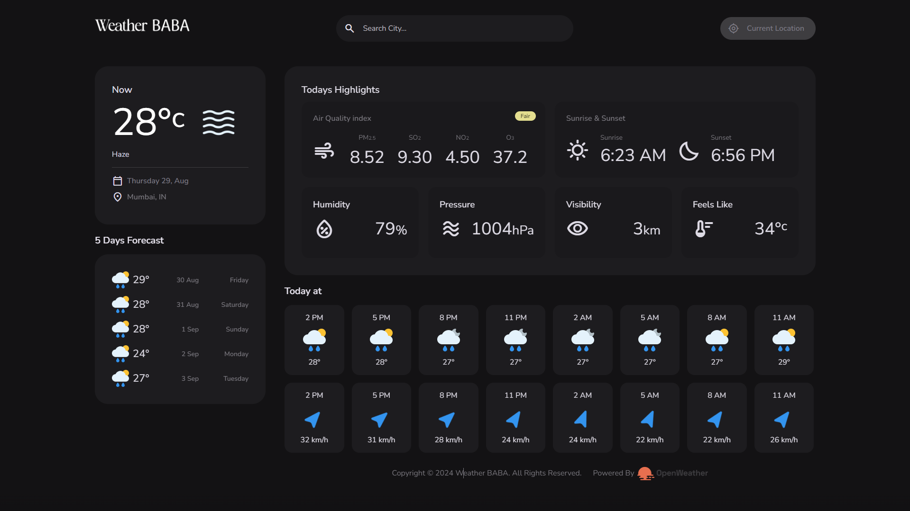
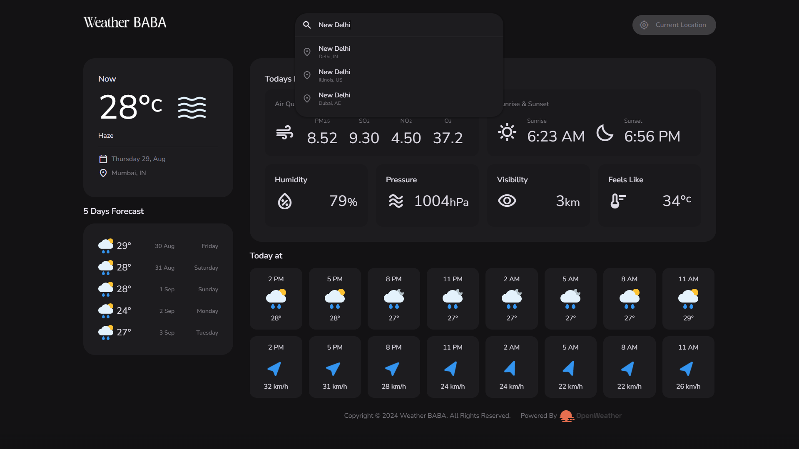
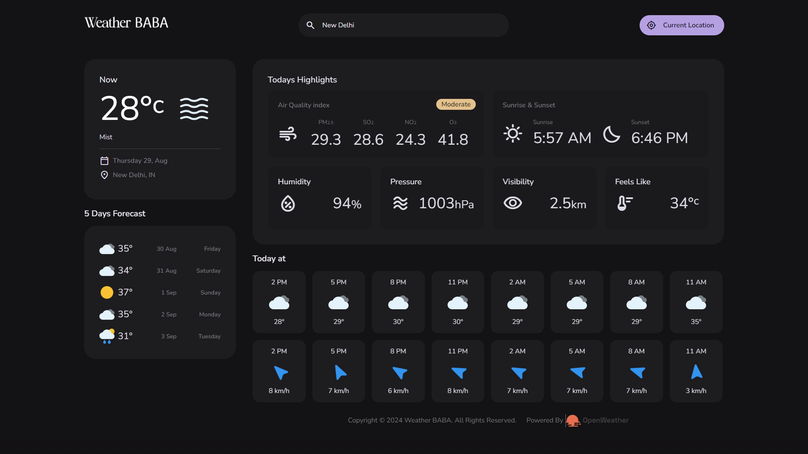
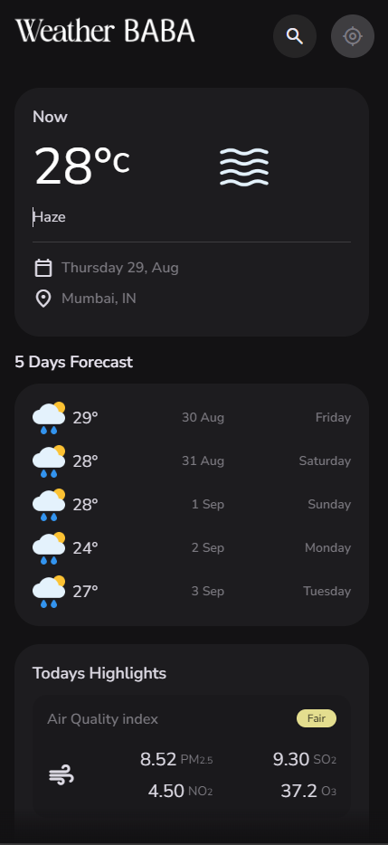
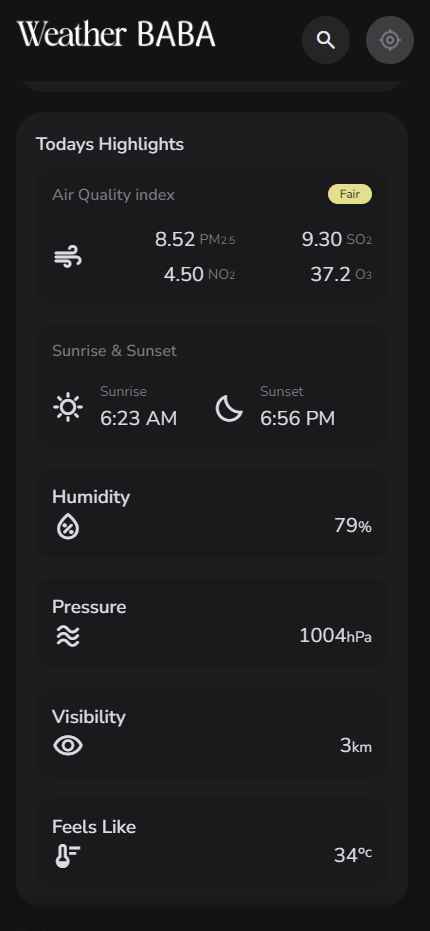

# Weather App - Weather Baba 🌦️

This Weather App is a dynamic and responsive web application that provides real-time weather updates and a 5-day forecast. Built with vanilla JavaScript, HTML, and CSS, it integrates a weather API to fetch and display weather data for any location. The app includes a search function, displays wind speed, and adapts seamlessly to both desktop and mobile devices.

## Features

- **Responsive Design**: Fully responsive, ensuring a seamless experience on all devices, including desktops, tablets, and smartphones.
- **Real-Time Weather Data**: Displays current weather conditions, including temperature, humidity, and weather description.
- **5-Day Forecast**: Provides a detailed weather forecast for the next 5 days.
- **Wind Speed**: Shows the wind speed for the selected location.
- **Search Functionality**: Easily search for the weather in any city or location.
- **User-Friendly Interface**: Intuitive and easy-to-use interface with a clean design.

## Technology Stack

- **HTML5**: For the structure of the app.
- **CSS3**: For styling and creating a responsive design.
- **JavaScript (ES6+)**: Core functionality, including API integration and dynamic content rendering.
- **Weather API**: Used to fetch real-time weather data and forecasts.

## Screenshots

### Home Page

### Mobile Home Page

### Mobile Search Page

## How It Works

1. **Search**: Enter the name of a city or location in the search bar to fetch the current weather and 5-day forecast.
2. **Weather Display**: The app will display the current temperature, weather conditions, and wind speed for the searched location.
3. **Forecast**: The app provides a detailed 5-day weather forecast, allowing users to plan ahead.